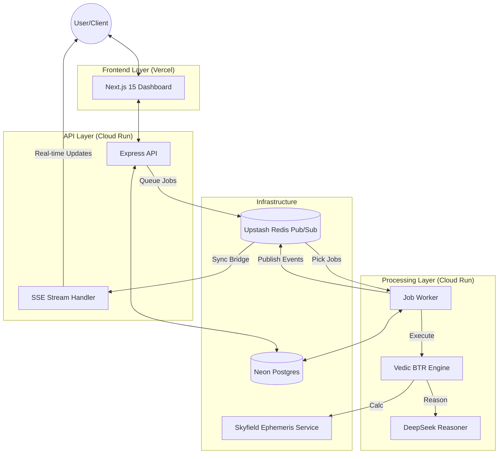

# AI-Pandit: Autonomous BTR Engine

[](LICENSE)
[](https://github.com/ashoksainiengineer/ai-pandit-app/actions)
[](.github/SECURITY.md)
[](docs/architecture.md)

> **⚠️ PROPRIETARY SOFTWARE — ALL RIGHTS RESERVED**
> This repository is publicly visible for transparency and portfolio purposes only.
> No license is granted to use, copy, modify, or distribute this code. See [LICENSE](LICENSE) for full terms.

AI-Pandit is a high-performance, autonomous Birth Time Rectification (BTR) platform for the determination of accurate birth times down to the **second**. It combines classical Vedic astrology with modern LLM reasoning (DeepSeek/Gemini) and NASA JPL DE440 ephemeris data.

---

## 🏗 Architecture Overview



---

## 📋 Table of Contents

- [Overview](#overview)
- [Features](#features)
- [Tech Stack](#tech-stack)
- [6-Stage BTR Pipeline](#6-stage-btr-pipeline)
- [Repository Map](#repository-map)
- [Quick Start](#quick-start)
- [Environment Variables](#environment-variables)
- [Deployment](#deployment)
- [Security](#security)
- [Testing](#testing)
- [License](#license)
- [Contact](#contact)

---

## 🌟 Overview

AI-Pandit replaces subjective manual BTR with a data-driven autonomous pipeline. It generates thousands of candidate birth times, runs them through successive AI-supervised elimination rounds (Dasha verification, transit matching, KP Sublord analysis, Shadbala evaluation), and converges on the most astronomically and astrologically consistent time.

The system processes **life events** as input constraints, cross-references against **JPL DE440 ephemeris** via Skyfield, and encrypts all PII with **AES-256-GCM** end-to-end.

---

## 🚀 Features

- **Autonomous 6-Stage Pipeline**: Grid Generation → Batch Tournament → Refinement → Deep Analysis → Micro Grid → Final Verdict.
- **Real-Time SSE Streaming**: Live progress updates with Zustand + IndexedDB persistence.
- **NASA-Precision Ephemeris**: Skyfield service providing arcsecond-precision planetary positions.
- **AI-Driven Reasoning**: DeepSeek-Reasoner model for complex astrological synthesis.
- **End-to-End Encryption**: AES-256-GCM with user-isolated keys and multi-version format support.
- **Interactive Dashboard**: Full session management, PDF exports, and Recharts visualizations.

---

## 🛠 Tech Stack

| Layer | Technology |
|-------|------------|
| **Frontend** | Next.js 15, React 18, Zustand, Tailwind CSS, Framer Motion, Recharts |
| **Backend** | Node.js (Express), TypeScript, Drizzle ORM, Zod |
| **Database** | Neon Postgres (Serverless) |
| **Cache/Queue**| Upstash Redis (ioredis) |
| **AI** | DeepSeek (Reasoner/V4 Flash), Groq (Fallback) |
| **Auth** | Clerk (OAuth/MFA) |
| **Ephemeris** | Python 3, FastAPI, Skyfield (DE440 Kernel) |
| **Deployment** | Vercel (Web), Google Cloud Run (API/Worker/Ephemeris) |

---

## ⚖️ 6-Stage BTR Pipeline

| Stage | Name | Description |
|-------|------|-------------|
| 1 | **Grid Generation** | Generate exhaustive candidate time grid around tentative birth time |
| 2 | **Batch Tournament** | AI-supervised batch elimination — prune clearly incompatible candidates |
| 3 | **Refinement Grid** | Sub-second finer grid around remaining survivors |
| 4 | **Deep Analysis** | Multi-dasha, multi-transit cross-validation with life events |
| 5 | **Micro Grid** | Seconds-level grid with precision ephemeris data |
| 6 | **Final Precision** | AI synthesis of all evidence → final rectified time + verdict |

---

## 🗺 Repository Map

```
ai-pandit/
├── apps/
│   ├── web/                      # Next.js 15 frontend dashboard
│   ├── api/                      # Express + TypeScript BTR orchestrator
│   └── worker/                   # External background job worker
├── packages/
│   ├── db/                       # Drizzle schema + client (Neon)
│   ├── shared/                   # Shared Zod schemas and TS types
│   └── worker-runtime/           # Shared worker processing library
├── services/
│   └── ephemeris/                # Python FastAPI Skyfield microservice
├── e2e/                          # Playwright end-to-end tests
├── scripts/                      # Deployment and utility scripts
├── .github/                      # CI/CD workflows and templates
└── AGENTS.md                     # Agent operating manual
```

---

## ⚡ Quick Start

### 1. Installation
```bash
npm ci
npm run setup:ephemeris
npm run ephemeris:download-kernel
```

### 2. Environment Setup
```bash
cp .env.example .env.local
# Edit .env.local with your keys (Clerk, Neon, Redis, DeepSeek)
```

### 3. Database & Dev
```bash
npm -w @ai-pandit/api run db:push
npm run dev
```

---

## 🔒 Security

- **PII Encryption**: AES-256-GCM at rest/transit. Key derived via `scrypt` with user-specific salt.
- **AI Anonymization**: All prompts are stripped of names and exact birth locations before inference.
- **Auth Hardening**: Clerk-managed session tokens, MFA support, and CSRF protection.
- **Infrastructure**: All services deployed with identity-aware IAM on Google Cloud.

---

## 🧪 Testing

```bash
npm run test           # All unit tests
npm run test:integration # API + DB integration
npm run test:e2e:smoke  # Critical path E2E
npm run test:security   # Dependency and secret scan
```

---

## 📄 License

Proprietary. See [LICENSE](LICENSE) for full terms. 
No license is granted for use, modification, or distribution.

---

## 📬 Contact

**Author:** Ashok Saini  
**Email:** app.aipandit [at] gmail [dot] com  
**Repository:** [github.com/ashoksainiengineer/ai-pandit-app](https://github.com/ashoksainiengineer/ai-pandit-app)

---

**Built with ❤️ for the Vedic astrology community**
