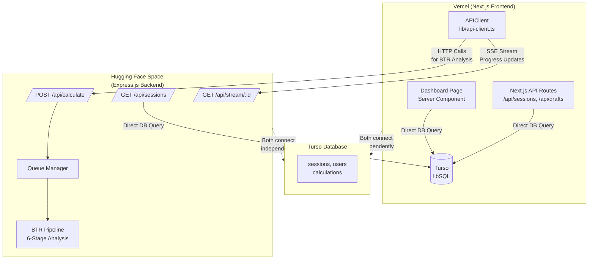
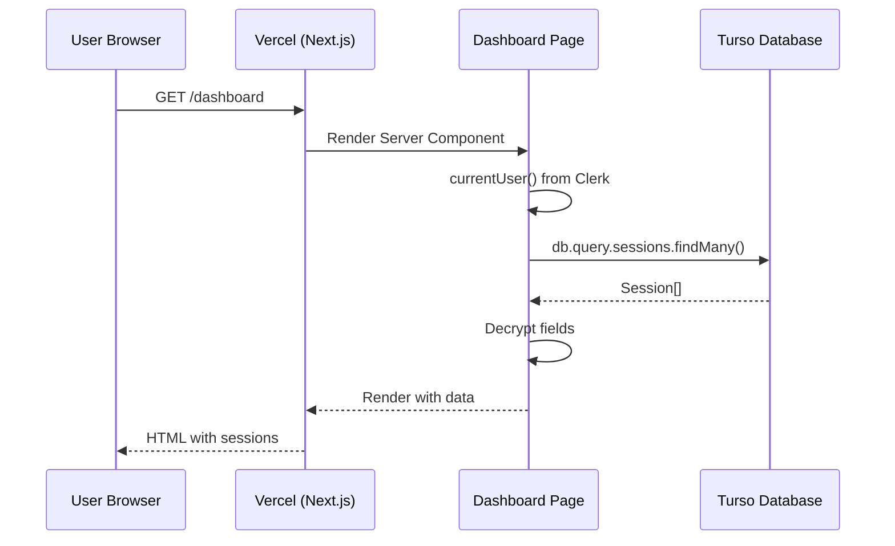
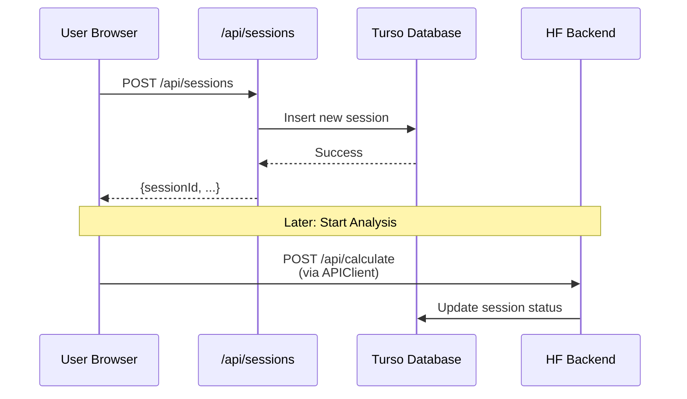
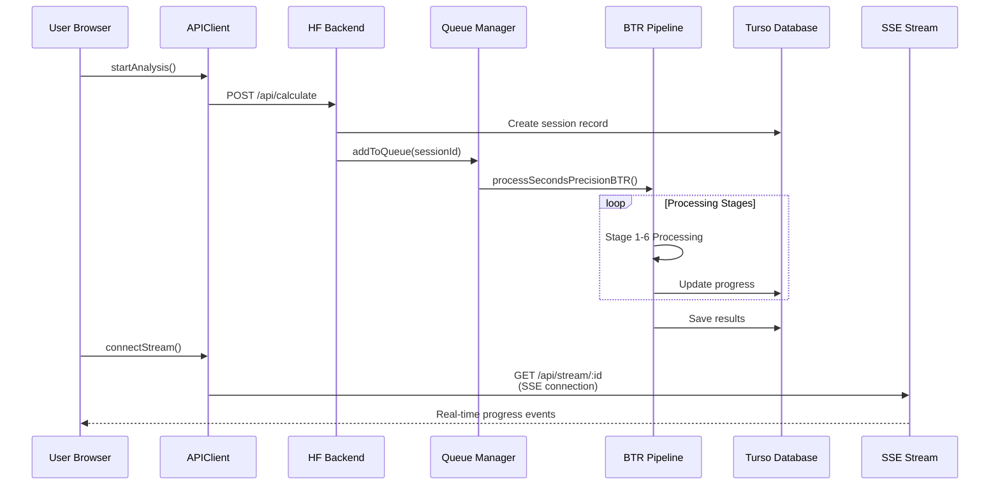
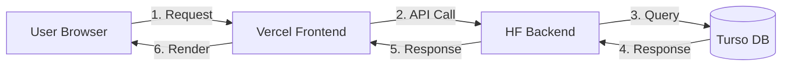
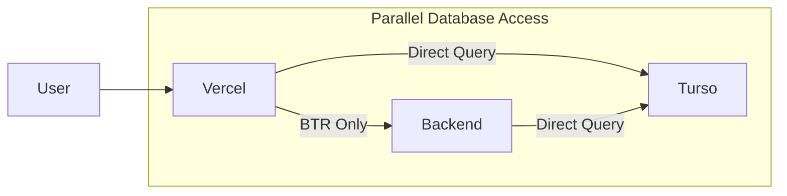

# Deep Architecture Analysis: Frontend-Backend-Database Communication Flow

## Executive Summary

**CRITICAL FINDING**: The current architecture has the frontend connecting **DIRECTLY** to Turso database, which is NOT the expected pattern. Both Vercel frontend and Hugging Face backend connect independently to the same Turso database.

---

## Current Architecture (ACTUALLY IMPLEMENTED)



---

## Data Flow Analysis

### 1. Dashboard Load Flow



**Key Finding**: Dashboard page (`apps/web/app/dashboard/page.tsx:184`) directly queries Turso via `db.query.sessions.findMany()` - NO backend API call involved.

### 2. Session Creation Flow



**Key Finding**: Session creation happens via Next.js API route (`apps/web/app/api/sessions/route.ts:61`) - NOT backend Express.

### 3. BTR Analysis Flow



**Key Finding**: Only BTR analysis goes through backend; all CRUD operations happen via frontend API routes.

---

## Direct Database Access Evidence

### Frontend Direct DB Access Points

| File | Line | Action |
|------|------|--------|
| `apps/web/app/dashboard/page.tsx` | 11, 67-68 | `import { db } from '@ai-pandit/db'` and direct query |
| `apps/web/app/api/sessions/route.ts` | 4, 20-30 | `import { db }` and `db.query.users.findFirst()` |
| `apps/web/app/api/sessions/[id]/route.ts` | 3, 27-29 | `import { db }` and `db.query.sessions.findFirst()` |
| `apps/web/app/api/drafts/route.ts` | 3, 37 | `import { db }` and `db.query.users.findFirst()` |

### Backend Direct DB Access Points

| File | Line | Action |
|------|------|--------|
| `apps/api/src/routes/sessions.ts` | 5, 24-28 | `import { db }` and `db.query.users.findFirst()` |
| `apps/api/src/routes/calculate.ts` | 5, 104 | `import { db }` and `db.insert(sessions)` |
| `apps/api/src/lib/queue-manager.ts` | 5, 109 | `import { db }` and `db.update(sessions)` |
| `apps/api/src/lib/user-sync.ts` | 1, 44 | `import { db }` and `db.select().from(users)` |

### Shared Package

```typescript
// packages/db/src/drizzle.ts
// This package is imported by BOTH frontend and backend
export { client, db };
// Uses process.env.TURSO_DATABASE_URL and TURSO_AUTH_TOKEN
```

---

## Environment Variables Analysis

### Frontend Environment Variables (Vercel)

```bash
# Required for Frontend Direct DB Access
TURSO_DATABASE_URL=libsql://your-db.turso.io
TURSO_AUTH_TOKEN=your-turso-token

# Frontend-specific
NEXT_PUBLIC_CLERK_PUBLISHABLE_KEY=pk_...
CLERK_SECRET_KEY=sk_...
NEXT_PUBLIC_BACKEND_URL=https://your-hf-space.hf.space
ENCRYPTION_SECRET=...  # For decrypting DB fields
```

### Backend Environment Variables (HF Space)

```bash
# Required for Backend Direct DB Access
TURSO_DATABASE_URL=libsql://your-db.turso.io
TURSO_AUTH_TOKEN=your-turso-token

# Backend-specific
CLERK_SECRET_KEY=sk_...
AI_API_KEY=...  # DeepSeek/OpenRouter
PORT=3001
```

### Finding: DUPLICATE DB CREDENTIALS

Both frontend and backend require the **same** Turso credentials. This means:
- Database URL is exposed to Vercel (client-side accessible in API routes)
- Both services compete for same connection pool
- No single source of truth for DB access

---

## Expected vs Actual Architecture

### User's Expected Architecture



**Expected Flow**: Frontend NEVER touches DB directly - all data goes through backend API.

### Actual Architecture



**Actual Flow**: Frontend queries DB directly for most operations; only BTR analysis uses backend.

---

## Duplicate API Routes Analysis

| Operation | Frontend Route | Backend Route | Winner |
|-----------|---------------|---------------|--------|
| List Sessions | `/api/sessions` (Next.js) | `/api/sessions` (Express) | Frontend |
| Get Session | `/api/sessions/[id]` | `/api/sessions/:id` | Frontend |
| Create Session | `/api/sessions` POST | - | Frontend |
| Update Session | `/api/sessions/[id]` PUT | `/api/sessions/:id` PUT | Frontend |
| Delete Session | `/api/sessions/[id]` DELETE | - | Frontend |
| Save Draft | `/api/drafts` | - | Frontend |
| Start Analysis | - | `/api/calculate` | Backend |
| Get Progress | - | `/api/queue/progress/:id` | Backend |
| Stream Updates | - | `/api/stream/:id` | Backend |

**Result**: Frontend routes are PRIMARY for data access; backend routes are ONLY for BTR processing.

---

## Impact Analysis

### If Backend Fails to Initialize

| Feature | Status | Explanation |
|---------|--------|-------------|
| Dashboard Display | ✅ Works | Direct DB query from Next.js |
| Session List | ✅ Works | Direct DB query from Next.js |
| Create Session | ✅ Works | Next.js API route writes to DB |
| Update Session | ✅ Works | Next.js API route writes to DB |
| View Session Details | ✅ Works | Direct DB query from Next.js |
| Start BTR Analysis | ❌ Fails | Requires backend queue |
| Real-time Progress | ❌ Fails | Requires backend SSE stream |
| Get Results | ⚠️ Partial | Can read from DB but no analysis |

**Answer to User's Question**: **YES**, dashboard will still show data if backend fails. Frontend operates independently for all CRUD operations.

---

## Security Implications

### Current Security Model

1. **Database Credentials**: Stored in Vercel environment (server-side only for API routes)
2. **Encryption Secret**: Required on both frontend (for decryption) and backend
3. **Clerk Auth**: Used by both services independently

### Potential Issues

| Issue | Severity | Description |
|-------|----------|-------------|
| Credential Duplication | Medium | Same DB credentials in two services |
| No API Gateway | Medium | No central control point for data access |
| Inconsistent Encryption | High | Frontend and backend use different encryption keys/patterns |
| Auth Logic Duplication | Medium | Auth middleware in both Next.js and Express |

### Encryption Inconsistency

```typescript
// Frontend encryption (apps/web/lib/crypto.ts)
encrypt(birthData.fullName)  // Uses ENCRYPTION_SECRET

// Backend encryption (apps/api/src/lib/encryption/)
encryptData(birthData.fullName, clerkId)  // Uses clerkId as key component
```

**CRITICAL**: Frontend and backend use DIFFERENT encryption methods! This could cause data corruption.

---

## Recommendations

### Option 1: Keep Current Architecture (Document It)

**Pros:**
- Dashboard loads faster (no API round-trip)
- Reduces backend load
- Works offline if backend is down

**Cons:**
- Security complexity with dual credential management
- Inconsistent encryption between frontend/backend
- Harder to maintain (two sets of API routes)
- No central data validation

**Actions Required:**
1. Document the dual-access pattern clearly
2. Fix encryption to use consistent method
3. Add DB-level constraints for data integrity
4. Implement proper credential rotation process

### Option 2: Migrate to Backend-Only DB Access (Expected Architecture)

**Pros:**
- Single source of truth for data access
- Centralized validation and business logic
- Better security (DB credentials only in backend)
- Easier to maintain and audit

**Cons:**
- Slower dashboard load (extra API hop)
- Backend becomes critical path
- More complex deployment coordination

**Migration Steps:**
1. Update frontend dashboard to call backend API
2. Update frontend components to use backend endpoints
3. Remove Next.js API routes that access DB
4. Remove `@ai-pandit/db` dependency from frontend
5. Move all encryption/decryption to backend

### Option 3: Hybrid Approach (Recommended)

Keep direct DB access for READ operations (dashboard), but route all WRITE operations through backend.

**Pros:**
- Fast dashboard reads
- Centralized write validation
- Gradual migration path

**Implementation:**
1. Frontend: Read from DB directly
2. Frontend: Write via backend API
3. Backend: All operations go through single service layer
4. Eventual consistency through DB triggers

---

## Code Examples

### Current: Frontend Direct DB Query
```typescript
// apps/web/app/dashboard/page.tsx
import { db } from '@ai-pandit/db';

async function getUserSessions(clerkId: string) {
  return db.query.sessions.findMany({
    where: eq(sessions.clerkId, clerkId),
    orderBy: [desc(sessions.createdAt)],
  });
}
```

### Recommended: Backend API Call
```typescript
// apps/web/lib/api-client.ts
export async function getUserSessions(getToken: () => Promise<string | null>) {
  return APIClient.get(`${env.api.backendUrl}/api/sessions`, getToken);
}
```

### Current: Frontend API Route
```typescript
// apps/web/app/api/sessions/route.ts
import { db } from '@ai-pandit/db';

export async function GET(req: NextRequest) {
  const { userId: clerkId } = await auth();
  const userSessions = await db.select().from(sessions)
    .where(eq(sessions.userId, user.id));
  return NextResponse.json({ success: true, data: userSessions });
}
```

---

## Conclusion

**The architecture is NOT what the user expected.** The frontend connects directly to Turso database for most operations, making the backend optional for basic functionality.

### Key Takeaways:

1. ✅ **Both services have Turso credentials** - Frontend and backend both connect directly
2. ✅ **Dashboard works without backend** - Direct DB queries in Next.js Server Components
3. ✅ **BTR analysis requires backend** - Queue processing only happens in Express backend
4. ⚠️ **Duplicate API routes exist** - Both Next.js and Express have `/api/sessions`
5. ❌ **Inconsistent encryption** - Frontend and backend use different encryption methods
6. ⚠️ **No clear separation of concerns** - Data access scattered across both services

### Decision Required:

The user must choose:
- **Keep current**: Document and fix encryption inconsistency
- **Migrate**: Route all DB access through backend (traditional 3-tier architecture)
- **Hybrid**: Keep reads on frontend, move writes to backend

---

*Analysis generated on: 2026-03-08*
*Files analyzed: 15+ across apps/web, apps/api, packages/db*
