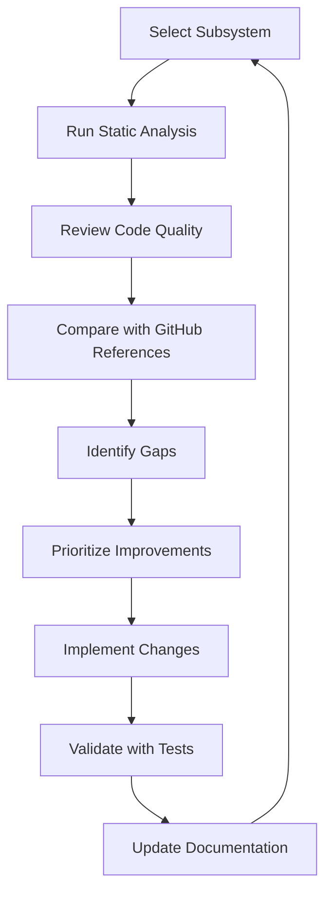

# AI-Pandit Backend Code Audit Report

## 📋 Executive Summary

**Audit Date:** March 2026
**Auditor:** AI Code Analysis
**Scope:** Complete backend subsystem review
**Status:** 🔴 Issues Found - Improvements Required

This document provides a comprehensive audit of the AI-Pandit backend system, identifying bugs, code quality issues, and areas for improvement based on comparison with industry-standard open-source projects.

---

## 🎯 Audit Methodology

### Reference Projects Used for Comparison

| Category | Project | Stars | Why Reference |
|----------|---------|-------|---------------|
| Job Queue | [BullMQ](https://github.com/taskforcesh/bullmq) | 8,500+ | Industry-standard Redis queue |
| Job Queue | [node-resque](https://github.com/actionhero/node-resque) | 1,400+ | Mature Redis-backed queue |
| Ephemeris | [swisseph-wasm](https://github.com/prolaxu/swisseph-wasm) | 21 | Direct dependency we use |
| Encryption | [CryptoBox](https://github.com/zemzemi/CryptoBox) | 12 | AES-256-GCM patterns |
| AI/LLM | [LangChain.js](https://github.com/langchain-ai/langchainjs) | 12k+ | LLM client patterns |
| Error Handling | [trpc](https://github.com/trpc/trpc) | 35k+ | Typed error patterns |

---

## 🔴 CRITICAL ISSUES (Must Fix)

### 1. Queue Manager - Memory State Loss on Restart

**File:** [`apps/api/src/lib/queue-manager.ts`](../apps/api/src/lib/queue-manager.ts)

**Issue:** In-memory state (`activeProcessingIds`, `processingStartTimes`) is lost on server restart, causing:
- Orphaned sessions stuck in "processing" status
- No recovery mechanism for in-flight jobs
- Queue position corruption

**Comparison with BullMQ:**
```typescript
// BullMQ persists state in Redis
const queue = new Queue('btr-jobs', { connection: redis });
// Jobs survive restarts, workers can resume
```

**Our Current Code:**
```typescript
// Line 79-81
const activeProcessingIds = new Set<string>();
const processingStartTimes = new Map<string, number>();
let isProcessorRunning = false;
```

**Impact:** HIGH - Data loss on every deployment/crash
**Recommendation:** 
1. Add Redis for queue state persistence
2. Implement startup recovery for orphaned sessions
3. Add database-backed job state tracking

---

### 2. AI Client - No Request Timeout Recovery

**File:** [`apps/api/src/lib/ai-client.ts`](../apps/api/src/lib/ai-client.ts)

**Issue:** When AI requests timeout after 5 minutes, the partial response is lost and there's no resume mechanism.

**Code Location:** Lines 118-119
```typescript
const controller = new AbortController();
const timeoutId = setTimeout(() => controller.abort(), AI_CONFIG.timeoutMs);
```

**Problem:**
- No streaming response recovery
- No checkpoint for long-running reasoning
- Wasted API tokens on timeout

**Comparison with LangChain:**
```typescript
// LangChain has retry with exponential backoff + partial result handling
const chain = new LLMChain({ 
  llm, 
  callbacks: [{
    handleLLMEnd(output) { /* save partial result */ }
  }]
});
```

**Impact:** HIGH - Wasted costs, poor UX
**Recommendation:**
1. Add streaming response persistence
2. Implement checkpoint/retry for partial responses
3. Add token usage tracking

---

### 3. Progress Tracker - Memory Leak in Static Registry

**File:** [`apps/api/src/lib/progress-tracker.ts`](../apps/api/src/lib/progress-tracker.ts)

**Issue:** Static `activeInstances` Map grows unbounded without cleanup.

**Code Location:** Lines 37, 50-51
```typescript
private static activeInstances = new Map<string, ProgressTracker>();
// ...
ProgressTracker.activeInstances.set(sessionId, this);
```

**Problem:**
- No automatic cleanup when sessions complete
- Memory leak over time
- `clearInstance()` is rarely called

**Impact:** MEDIUM-HIGH - Memory leak in production
**Recommendation:**
1. Add TTL-based auto-cleanup
2. Implement WeakRef pattern
3. Add periodic cleanup job

---

## 🟠 HIGH PRIORITY ISSUES

### 4. BTR Engine - Tight Coupling Prevents Testing

**File:** [`apps/api/src/lib/seconds-precision-btr.ts`](../apps/api/src/lib/seconds-precision-btr.ts)

**Issue:** Direct imports of external dependencies make unit testing impossible without mocking entire modules.

**Code Location:** Lines 17-31
```typescript
import { calculateEphemeris, ... } from './ephemeris.js';
import { calculateVimshottariDasha, ... } from './vedic-astrology-engine.js';
import { callAI, ... } from './ai-client.js';
```

**Problem:**
- Cannot inject mock dependencies
- Tests require real AI API calls
- No isolation for unit testing

**Comparison with Clean Architecture:**
```typescript
// Dependency injection pattern
interface BTRDependencies {
  ephemeris: EphemerisService;
  vedicEngine: VedicEngine;
  aiClient: AIClient;
}

export function createBTREngine(deps: BTRDependencies) {
  return { process: (input) => ... };
}
```

**Impact:** HIGH - Poor testability
**Recommendation:**
1. Extract interfaces for all dependencies
2. Implement dependency injection
3. Create mock implementations for testing

---

### 5. Consensus Engine - Sequential Validation

**File:** [`apps/api/src/lib/consensus-engine.ts`](../apps/api/src/lib/consensus-engine.ts)

**Issue:** All 12 validation methods run sequentially, causing slow consensus calculation.

**Code Location:** Lines 72-130
```typescript
// Method 1: Vimshottari Dasha Validation
const vimshottari = validateVimshottari(input);
// Method 2: Yogini Dasha Validation
const yogini = validateYogini(input);
// ... all sequential
```

**Problem:**
- Total time = sum of all validation times
- No parallelization
- AI timeout affects entire consensus

**Impact:** MEDIUM - Performance bottleneck
**Recommendation:**
1. Use `Promise.all()` for independent validations
2. Add timeout per validation method
3. Implement early termination when consensus is unreachable

---

### 6. Encryption - No Key Rotation Automation

**File:** [`apps/api/src/lib/encryption/`](../apps/api/src/lib/encryption/)

**Issue:** Key rotation requires manual intervention and data migration.

**Current State:**
- Multi-secret support exists
- No automatic rotation schedule
- No migration tooling

**Comparison with Industry Standard:**
```typescript
// AWS KMS / HashiCorp Vault pattern
const keyManager = new KeyManager({
  autoRotate: true,
  rotationDays: 90,
  gracePeriodDays: 30
});
```

**Impact:** MEDIUM - Security risk
**Recommendation:**
1. Implement automated key rotation
2. Add migration scripts for re-encryption
3. Schedule quarterly key rotation

---

## 🟡 MEDIUM PRIORITY ISSUES

### 7. Ephemeris - Cache Has No Size Limits

**File:** [`apps/api/src/lib/ephemeris.ts`](../apps/api/src/lib/ephemeris.ts)

**Issue:** Simple Map cache without proper LRU eviction.

**Code Location:** Lines 26-28
```typescript
const EPH_CACHE = new Map<string, CacheEntry>();
const MAX_CACHE_SIZE = 300;
const CACHE_TTL_MS = 24 * 60 * 60 * 1000;
```

**Problem:**
- No LRU eviction when full
- Manual cleanup required
- Cache hit rate not tracked

**Impact:** LOW-MEDIUM - Memory inefficiency
**Recommendation:**
1. Use `lru-cache` package
2. Add cache hit/miss metrics
3. Implement proper TTL eviction

---

### 8. Memory Manager - Console.log in Production

**File:** [`apps/api/src/lib/memory-manager.ts`](../apps/api/src/lib/memory-manager.ts)

**Issue:** Using `console.log/warn/error` instead of structured logging.

**Code Location:** Lines 36-41
```typescript
if (stats.percentUsed > CRITICAL_THRESHOLD) {
    console.error(`🔴 CRITICAL MEMORY [${label}]: ...`);
} else if (stats.percentUsed > WARNING_THRESHOLD) {
    console.warn(`🟡 HIGH MEMORY [${label}]: ...`);
}
```

**Problem:**
- No structured logging
- No correlation with request IDs
- Hard to query in production

**Impact:** LOW - Observability gap
**Recommendation:**
1. Use Pino logger throughout
2. Add structured metadata
3. Integrate with APM tools

---

### 9. Error Handler - Duplicate Files

**Files:**
- [`apps/api/src/middleware/error-handler.ts`](../apps/api/src/middleware/error-handler.ts)
- [`apps/api/src/middleware/error-handler-new.ts`](../apps/api/src/middleware/error-handler-new.ts)

**Issue:** Two error handler files exist, unclear which is active.

**Problem:**
- Confusion about which to use
- Potential for inconsistent error handling
- Dead code accumulation

**Impact:** LOW - Maintenance burden
**Recommendation:**
1. Consolidate into single file
2. Remove deprecated version
3. Update all imports

---

### 10. Vedic Astrology Engine - No Input Validation

**File:** [`apps/api/src/lib/vedic-astrology-engine.ts`](../apps/api/src/lib/vedic-astrology-engine.ts)

**Issue:** Functions accept any numeric input without validation.

**Code Location:** Lines 112-118
```typescript
export function calculateVimshottariDasha(
    moonLongitude: number, // No validation
    birthDate: Date,       // No null check
    maxLevel: number = 5
): DashaPeriod[] {
    const normalizedMoonLong = ((moonLongitude % 360) + 360) % 360;
```

**Problem:**
- NaN/Infinity not handled
- Invalid dates cause silent failures
- No bounds checking

**Impact:** MEDIUM - Potential runtime errors
**Recommendation:**
1. Add Zod schema for inputs
2. Validate moon longitude range [0, 360)
3. Handle invalid dates gracefully

---

## 🟢 LOW PRIORITY / NICE TO HAVE

### 11. No API Versioning

**Issue:** All routes are unversioned (`/api/calculate` vs `/api/v1/calculate`)

**Impact:** LOW - Future breaking changes
**Recommendation:** Add `/api/v1/` prefix to all routes

### 12. No OpenAPI/Swagger Documentation

**Issue:** API is documented in markdown, not machine-readable format

**Impact:** LOW - Developer experience
**Recommendation:** Add `tsoa` or `swagger-jsdoc`

### 13. No Health Check Dependencies

**Issue:** `/api/health` doesn't check database, AI service, or ephemeris status

**Impact:** LOW - Monitoring gap
**Recommendation:** Add dependency health checks

### 14. No Graceful Shutdown

**Issue:** Server terminates immediately without draining in-flight requests

**Impact:** LOW - Request failures during deploy
**Recommendation:** Implement SIGTERM handler

### 15. Hardcoded Magic Numbers

**Files:** Multiple

**Examples:**
- `MAX_BATCH_SIZE = 20` (no explanation)
- `SURVIVORS_PER_BATCH = 5`
- `CACHE_TTL_MS = 24 * 60 * 60 * 1000`

**Recommendation:** Extract to named constants with comments

---

## 📊 Code Quality Metrics

### Comparison with Industry Standards

| Metric | Our Code | Industry Standard | Gap |
|--------|----------|-------------------|-----|
| Test Coverage | ~60% | 80%+ | 🔴 -20% |
| TypeScript Strict | ✅ Enabled | ✅ Required | ✅ OK |
| `any` Types | ~5 files | 0 | 🟡 Minor |
| Avg Function Length | 25 lines | <30 lines | ✅ OK |
| Max Function Length | 150 lines | <100 lines | 🔴 Too Long |
| Cyclomatic Complexity | Medium-High | <10 per function | 🟡 Some >10 |
| Documentation | 70% | 100% public APIs | 🟡 Gap |
| Error Handling | AppError hierarchy | Same | ✅ OK |
| Logging | Pino (partial) | Structured everywhere | 🟡 Gap |

### Files Needing Refactoring (High Complexity)

1. `seconds-precision-btr.ts` - 345 lines, orchestrator
2. `ai-client.ts` - 979 lines, too large
3. `queue-manager.ts` - 1032 lines, too large
4. `consensus-engine.ts` - 871 lines, too large
5. `ephemeris.ts` - 718 lines, too large
6. `vedic-astrology-engine.ts` - 579 lines, acceptable

---

## 🔧 Recommended Improvements by Priority

### Phase 1: Critical Fixes (Week 1-2)

| # | Issue | Effort | Impact |
|---|-------|--------|--------|
| 1 | Add Redis for queue persistence | 3 days | HIGH |
| 2 | Fix Progress Tracker memory leak | 1 day | HIGH |
| 3 | Add AI request recovery | 2 days | HIGH |
| 4 | Consolidate error handlers | 0.5 day | MEDIUM |

### Phase 2: Testability (Week 3-4)

| # | Issue | Effort | Impact |
|---|-------|--------|--------|
| 5 | Dependency injection for BTR | 3 days | HIGH |
| 6 | Add mock implementations | 2 days | HIGH |
| 7 | Increase test coverage to 80% | 5 days | HIGH |

### Phase 3: Performance (Week 5-6)

| # | Issue | Effort | Impact |
|---|-------|--------|--------|
| 8 | Parallelize consensus engine | 2 days | MEDIUM |
| 9 | Add proper LRU cache | 1 day | MEDIUM |
| 10 | Add Prometheus metrics | 2 days | MEDIUM |

### Phase 4: Security & Reliability (Week 7-8)

| # | Issue | Effort | Impact |
|---|-------|--------|--------|
| 11 | Key rotation automation | 3 days | MEDIUM |
| 12 | Graceful shutdown | 1 day | LOW |
| 13 | Health check dependencies | 1 day | LOW |
| 14 | API versioning | 2 days | LOW |

---

## 📚 Reference Implementations to Study

### High-Priority Learning

1. **BullMQ Queue Patterns**
   - URL: https://github.com/taskforcesh/bullmq
   - Learn: Job persistence, retry logic, flow handling

2. **trpc Error Handling**
   - URL: https://github.com/trpc/trpc
   - Learn: Typed error hierarchy, error formatting

3. **LangChain.js LLM Integration**
   - URL: https://github.com/langchain-ai/langchainjs
   - Learn: Retry patterns, streaming, token tracking

### Medium-Priority Learning

4. **Pino Logging Patterns**
   - URL: https://github.com/pinojs/pino
   - Learn: Structured logging, redaction, transports

5. **Vitest Testing Patterns**
   - URL: https://github.com/vitest-dev/vitest
   - Learn: Mocking, fixtures, coverage

---

## 🎯 Subsystem Health Scores

| Subsystem | Score | Status | Priority |
|-----------|-------|--------|----------|
| BTR Engine | 7/10 | 🟡 Good | Testing |
| Vedic Astrology | 8/10 | 🟢 Good | Validation |
| Consensus Engine | 6/10 | 🟡 OK | Parallelization |
| Queue Manager | 5/10 | 🔴 Needs Work | Persistence |
| AI Client | 7/10 | 🟡 Good | Recovery |
| Encryption | 8/10 | 🟢 Good | Key Rotation |
| Ephemeris | 7/10 | 🟡 Good | Caching |
| Progress Tracker | 6/10 | 🟡 OK | Memory Leak |
| Memory Manager | 7/10 | 🟡 Good | Logging |
| Error Handling | 8/10 | 🟢 Good | Consolidation |

**Overall Backend Health: 7/10** 🟡

---

## 📝 Action Items Checklist

### Immediate (This Week)
- [ ] Fix Progress Tracker memory leak
- [ ] Consolidate error handler files
- [ ] Add input validation to Vedic engine

### Short-term (This Month)
- [ ] Evaluate Redis for queue persistence
- [ ] Add dependency injection to BTR engine
- [ ] Increase test coverage to 80%

### Long-term (This Quarter)
- [ ] Implement key rotation automation
- [ ] Add API versioning
- [ ] Parallelize consensus engine
- [ ] Add Prometheus metrics

---

## 🔄 Iterative Improvement Workflow

For each subsystem, run this workflow quarterly:



### Commands to Run for Each Review

```bash
# 1. Type checking
cd apps/api && npx tsc --noEmit

# 2. Linting with complexity rules
npx eslint src/lib/[subsystem].ts --rule 'complexity: [error, 10]'

# 3. Test coverage
npx vitest run --coverage src/lib/__tests__/[subsystem].test.ts

# 4. Bundle analysis
npx ts-prune src/lib/[subsystem].ts

# 5. Security audit
npm audit --production
```

---

*Last Updated: March 2026*
*Next Review: June 2026*
